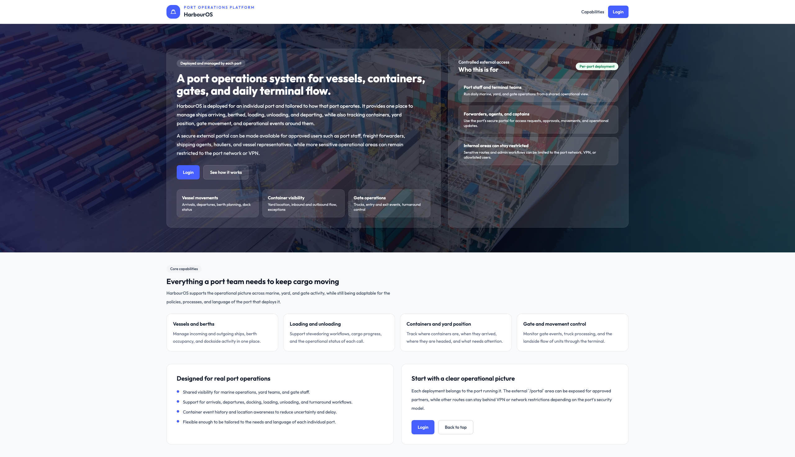
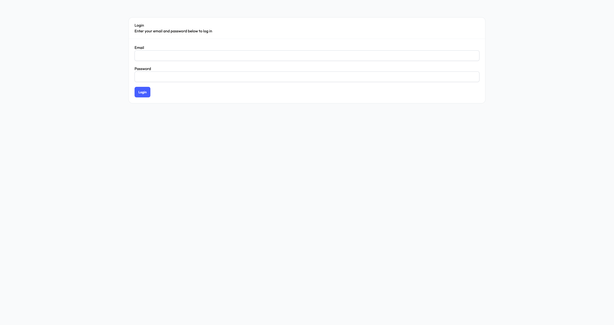
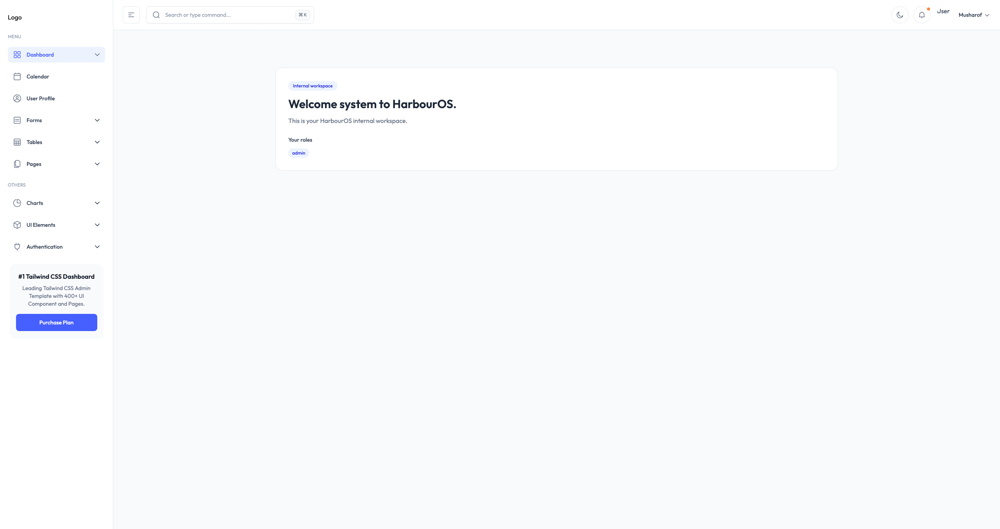
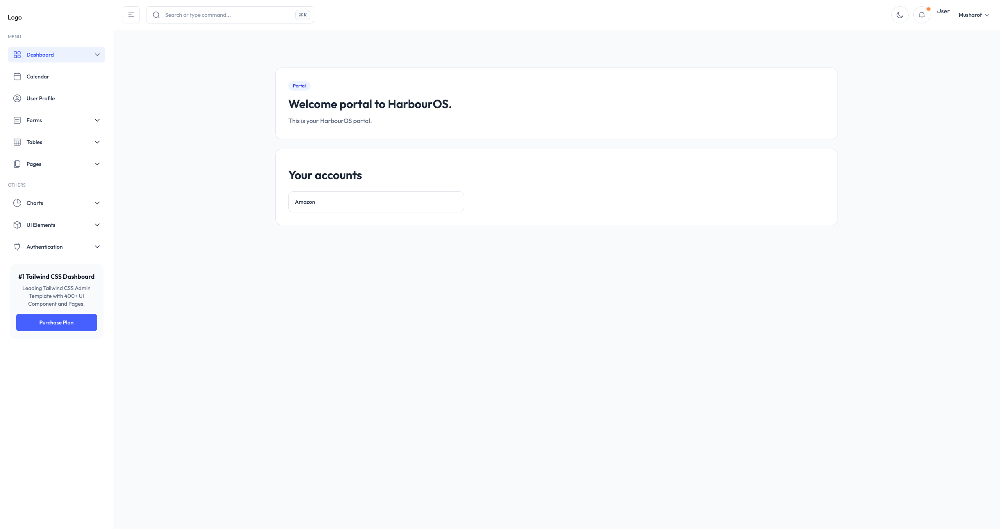
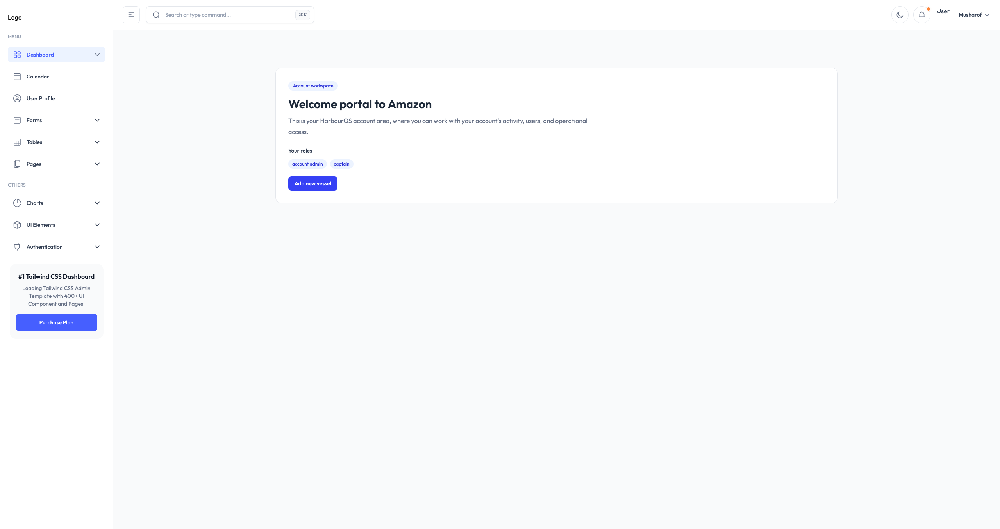

# Harbour OS

A modern web application for managing **port and harbour operations** from ship arrivals and berthing to container tracking, truck movements, storage, and logistics.

Built as a full-stack project to demonstrate clean architecture, role-based access control, and domain-specific features in the maritime/logistics sector.

## Key Features (Current Progress)
- Multi-account / multi-tenant portal with role-based access (e.g. port operators, shipping agents, truck companies)
- User authentication and secure session management
- Dashboard with accounts overview and member lists
- ISO 6346 container type and size mappings (standard for shipping containers)
- Rate limiting and security middleware
- Mail service integration

## Tech Stack
- **Backend**: AdonisJS (Node.js + TypeScript)
- **Frontend**: Vite + Edge templates + JavaScript
- **Styling**: Tailwind
- **Database**: SQLite3 
- **Other**: ESLint, Prettier, Vite

## Technical Specification
Full project vision and detailed requirements → [HarbourOS-Technical-Specification.pdf](HarbourOS-Technical-Specification.pdf)

## Screenshots

### Landing Page


### Portal Login


### Internal Dashboard (WIP)


### Portal Dashboard (WIP)


### Portal Account Dashboard (WIP)


## How to Run Locally

```bash
git clone https://github.com/carlbeattie2000/harbour_os.git
cd harbour_os

npm install

# Copy environment
cp .env.example .env

# Run database migrations (if applicable)
node ace migration:run

# Start the development server
node ace serve --watch
```
