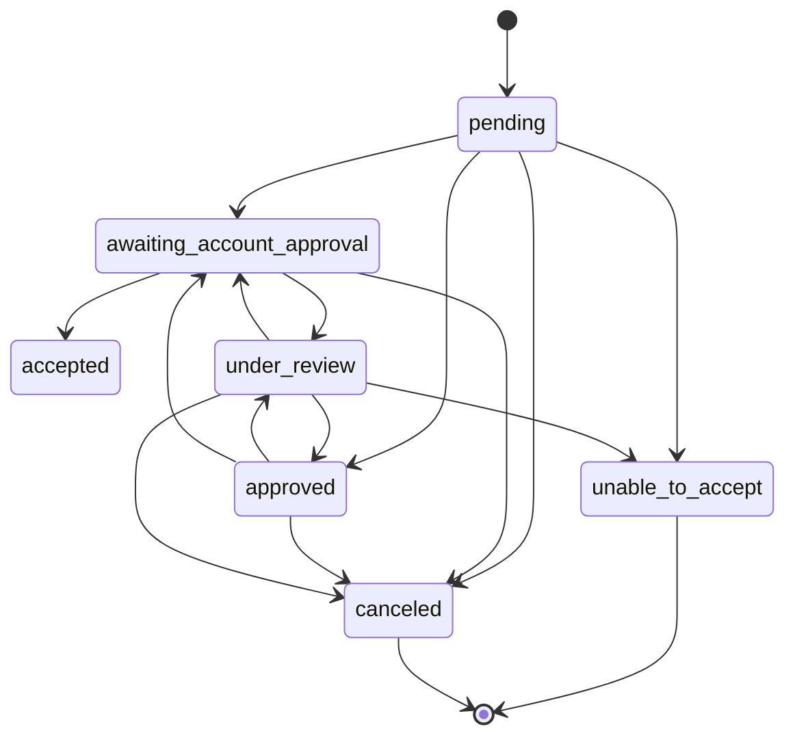

# Port call state machine

## Admin status

### pending

**Can transition to:**

- `awaiting_account_approval` - Internal staff makes changes which shipping line must accept/edit
- `approved` - Internal staff approve port call request
- `unable_to_accept` - Internal staff have decided the port call is unable to be accepted
- `canceled` - The shipping line has canceled the request

**On enter:**

- Notify internal staff of new port call request

---

### awaiting_account_approval

**Can transition to:**

- `accepted` - User account has accepted proposed changes
- `under_review` - User account has proposed changes
- `canceled` - User has canceled the request

**On enter:**

- Notify users belonging to account that action is required
